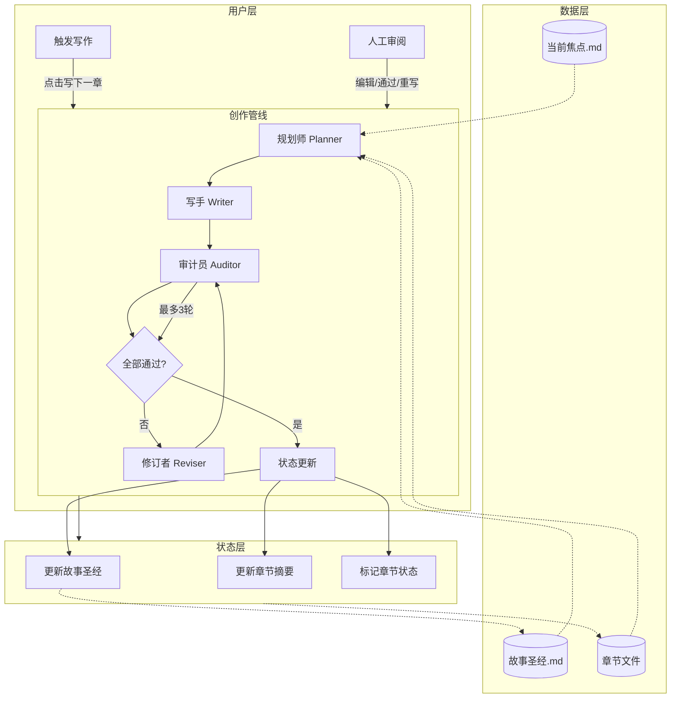

# EasyNovel — 轻量网络小说 AI Agent 产品文档

> 基于 [InkOS](https://github.com/Narcooo/inkos) 架构思想，精简为 4-Agent 管线 + 纯 Web 界面，聚焦"让作者能用 AI 快速写小说"。

---

## 一、产品定位

| 维度 | 说明 |
|------|------|
| 目标用户 | 网络小说作者、AI 写作爱好者、同人创作者 |
| 核心价值 | 一键生成符合设定、连续性好、少 AI 味的章节 |
| 设计原则 | 简单至上、人工可控、渐进学习 |
| 差异化 | 相比纯 LLM 聊天：有设定记忆、自动审计、迭代修订 |

---

## 二、功能列表

### 2.1 核心模块

| 模块 | 功能 | 优先级 | 说明 |
|------|------|--------|------|
| **书籍管理** | 创建书籍 | P0 | 选择题材、填写书名/世界观简述 |
| | 书籍列表 | P0 | 卡片式展示，进度条、字数、最后更新 |
| | 书籍设置 | P1 | 修改目标字数/章节数/写作状态 |
| | 删除书籍 | P1 | 确认后删除全部数据 |
| **创作管线** | 规划章节 (Plan) | P0 | 生成下一章大纲（场景、节奏、要点） |
| | 撰写章节 (Write) | P0 | 基于大纲+设定+前文摘要生成正文，去 AI 味 |
| | 审计章节 (Audit) | P0 | 6 维度检查：角色/物品/设定/AI味/节奏/伏笔 |
| | 修订章节 (Revise) | P1 | 自动修复关键问题，标记非关键问题 |
| | 一键写下一章 | P0 | Plan > Write > Audit > Revise 全自动 |
| **审阅编辑** | 章节列表 | P0 | 按章节展示，状态标签（草稿/待审/已通过/需修订） |
| | 章节编辑器 | P0 | Markdown 编写，实时字数统计 |
| | 审计结果面板 | P1 | 侧边栏展示每项检查结果 + 建议 |
| | 批量通过 | P2 | 一次性通过所有待审章节 |
| **设定管理** | 故事圣经 | P0 | 世界观/角色/势力/物品/地点（Markdown 编辑） |
| | 当前焦点 | P1 | 近期 1-3 章需聚焦的方向 |
| | 自动设定提取 | P2 | 写完后自动提取角色/物品更新到故事圣经 |
| **导出** | 导出 TXT | P1 | 全文或已通过章节 |
| | 导出 EPUB | P2 | 手机/Kindle 阅读格式 |

### 2.2 辅助模块

| 模块 | 功能 | 优先级 | 说明 |
|------|------|--------|------|
| **LLM 配置** | 服务商选择 | P0 | 支持 OpenAI 兼容接口 |
| | Base URL / API Key / Model | P0 | 自定义配置 |
| | 测试连接 | P1 | 验证配置可用性 |
| **提示词模板** | 题材模板库 | P1 | 内置玄幻/仙侠/都市/科幻等模板 |
| | 自定义模板 | P2 | 用户可创建自己的模板 |
| **创作简报** | 建书时传入脑洞 | P1 | 自动生成初始故事设定 |
| **续写导入** | 导入已有章节 | P2 | 解析已有文本，自动续写 |

---

## 三、Agent 管线流程图



### 3.1 各 Agent 职责

| Agent | 输入 | 输出 | 说明 |
|-------|------|------|------|
| **规划师 Planner** | 故事圣经 + 当前焦点 + 前 3 章摘要 + 用户指令 | 本章大纲（场景列表、节奏控制、注意事项） | 不调用 LLM 时也可手动编写大纲 |
| **写手 Writer** | 大纲 + 精简上下文 + 字数目标 | 本章正文 | 内置去 AI 味词表 + 禁用句式 + 文风规则 |
| **审计员 Auditor** | 正文 + 故事圣经 | 审计报告（6 维度：通过/警告/失败） | 不入库，仅输出报告 |
| **修订者 Reviser** | 正文 + 审计报告 | 修订后的正文 | 关键问题自动修复，非关键问题标记 |

### 3.2 审计 6 维度

```
  1. 角色一致性  角色行为、对话符合既定人设
  2. 物品连续性  物品/资源数量与前文一致
  3. 设定冲突    不违反世界观规则（如修仙等级体系）
  4. AI 味检测   无 LLM 高频词、句式单调、过度总结
  5. 叙事节奏    场景转换自然，不拖沓不跳脱
  6. 伏笔回收    前文伏笔被合理使用或推进
```

### 3.3 写作流程状态图

```
                    ┌─────────┐
                    │   空闲   │
                    └────┬────┘
                         │ 用户触发写下一章
                    ┌────▼────┐
                    │  规划中  │
                    └────┬────┘
                         │ 大纲生成完成
                    ┌────▼────┐
                    │  撰写中  │
                    └────┬────┘
                         │ 正文生成完成
                    ┌────▼────┐
                    │  审计中  │
                    └────┬────┘
                    ┌─────┴──────┐
                    │            │
                ┌───▼───┐  ┌────▼────┐
                │ 修订中 │  │ 已完成   │
                └───┬───┘  └────┬────┘
                    │           │
                    └── 最多3轮 ─┘
                         │
                    ┌────▼────┐
                    │  待审阅  │
                    └────┬────┘
                    ┌────┴────┐
                    │ 用户通过 │
                    └────┬────┘
                    ┌─────────┐
                    │   空闲   │
                    └─────────┘
```

---

## 四、与 InkOS 对比

| 维度 | InkOS (原版) | EasyNovel (轻量版) |
|------|-------------|-------------------|
| **Agent 数量** | 10（雷达/规划/编排/架构/写手/观察/反射/归一化/审计/修订） | 4（规划/写手/审计/修订） |
| **审计维度** | 33 维度 | 6 维度 |
| **真相文件** | 7 个 Markdown + SQLite 时序库 | 1 个故事圣经 Markdown |
| **交互方式** | CLI + TUI + Web + Agent 模式 | 纯 Web |
| **LLM 配置** | Provider Bank（10+ 服务商）+ 多模型路由 | 单一 OpenAI 兼容接口 |
| **字数治理** | 多层区间治理 + 纠偏 | 目标字数 ±20% |
| **守护进程** | 支持（inkos up 后台自动写） | 不支持（手动触发） |
| **通知推送** | Telegram / 飞书 / 企业微信 | 无 |
| **输入治理** | plan + compose 双阶段 | plan 单阶段 |
| **同人创作** | 4 种模式 + 正典导入 | P3 考虑中 |
| **文风仿写** | 统计指纹 + LLM 风格指南 | P3 考虑中 |
| **AIGC 检测** | 独立检测管线 | 合并在审计步骤 |
| **复杂度** |     |    |

---

## 五、数据模型

### 5.1 书籍 (Book)

```typescript
interface Book {
  id: string
  title: string
  genre: 'xuanhuan' | 'xianxia' | 'urban' | 'sci-fi' | 'horror' | 'other'
  status: 'active' | 'paused' | 'completed'
  targetWordsPerChapter: number
  targetChapters: number
  createdAt: string
  updatedAt: string
}
```

### 5.2 章节 (Chapter)

```typescript
interface Chapter {
  number: number
  title: string
  content: string
  status: 'draft' | 'pending_review' | 'approved' | 'needs_revision'
  wordCount: number
  outline?: string
  auditResult?: {
    passed: boolean
    dimensions: Array<{
      name: string
      status: 'pass' | 'warn' | 'fail'
      detail: string
    }>
    summary: string
  }
  createdAt: string
  updatedAt: string
}
```

### 5.3 故事圣经 (Story Bible)

```markdown
# 故事圣经

## 世界观
- 世界背景：
- 力量体系：
- 核心规则：

## 角色
| 名称 | 身份 | 实力 | 性格 | 关系 | 备注 |

## 物品
| 名称 | 归属 | 效果 | 当前状态 |

## 地点
| 名称 | 描述 | 关联势力 |

## 伏笔
| 伏笔 | 埋设章节 | 状态 | 预期回收 |
```
